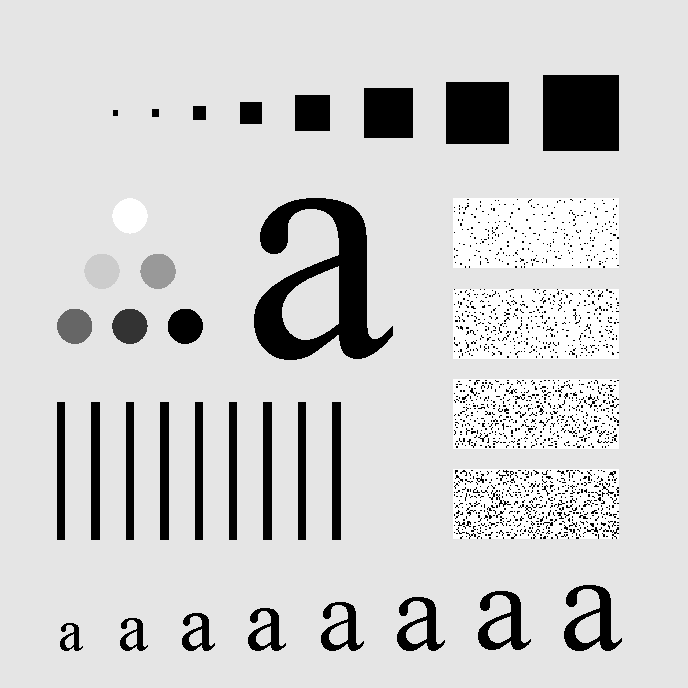
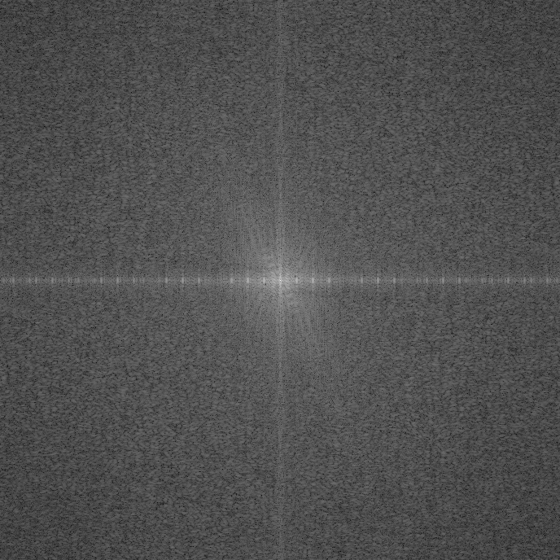
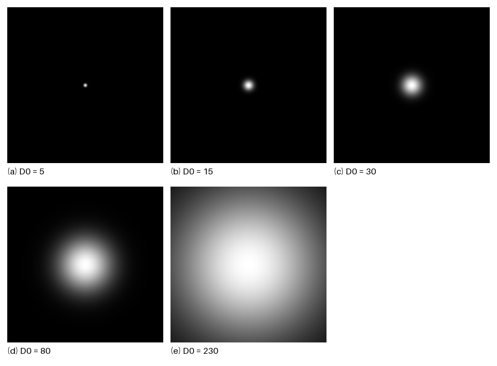
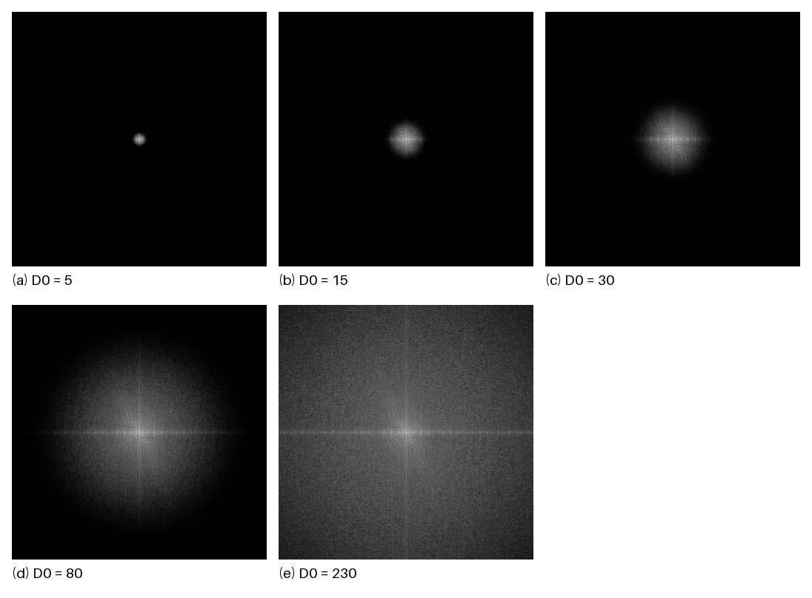
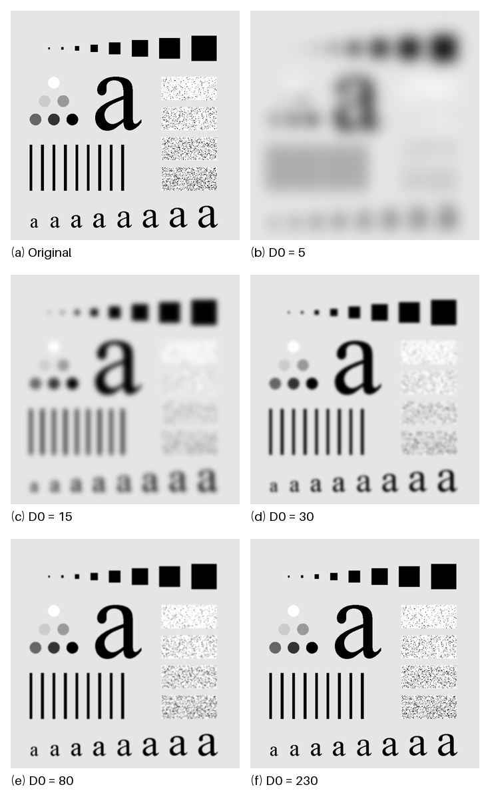
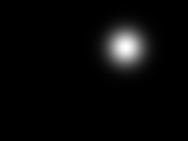

# 数字图像处理课程实验报告

## 小组成员及贡献

| 成员姓名 | 学号 | 项目与负责模块 | 代码及实验贡献 | 报告撰写贡献 |
|---|---|---|---|---|
| 李可 | 24325140 | 成员 A 负责 Project 04-03 与公共基础框架 | 图像读取、灰度化、归一化、保存与显示接口；可指定尺寸和中心的高斯响应；频域滤波与参数对比；数值验证 | 04-03 的原理、实现、结果分析及公共接口说明 |

## Project 04-03 高斯低通滤波

### 项目封面与摘要

课程名称：数字图像处理  
课程号：待填写  
项目题目：  
项目编号：Project 04-03  
学生姓名及学号：李可 24325140  
截止日期：待填写  
提交日期：待填写

**摘要：** 本实验实现二维高斯低通滤波器，并用频域乘法对字符测试图进行平滑。程序支持指定滤波器尺寸 M×N 和中心位置，实际图像滤波将中心放在移位后的直流频率处。输入为 688×688 的 8 位灰度 TIF，按参考图图注采用 D₀=5、15、30、80、230，主实验使用题目允许的不填充近似。D₀=15 对应 Fig. 4.18(c)，结果保留大字符和较大的方块轮廓，同时弱化细线、小字符及随机纹理；其归一化均值为 0.812999，与原图一致，梯度能量保留比例为 0.408%。随着 D₀ 增大，图像逐渐清晰，平滑程度降低。七项数值测试通过，验证了滤波响应、频率衰减及接口的正确性。

### 技术讨论

#### 实验题目、内容与目的

题目要求分为两部分。首先实现 Eq. (4.3-7) 中的二维高斯低通函数，允许指定输出尺寸和中心位置；其次对与 Fig. 4.11(a)、Fig. 4.18(a) 对应的字符测试图进行低通滤波，得到 Fig. 4.18(c) 所示的平滑效果。通过不同参数对比，理解低频轮廓、高频细节与平滑程度之间的关系。


#### 算法原理与实现技术

二维离散傅里叶变换为

$$
G=F_c H,\qquad
g=\mathrm{Re}\left\{\mathrm{IFFT2}\left[\mathrm{ifftshift}(G)\right]\right\}.
$$

采用 `fftshift` 将直流项移到频谱中央。高斯低通响应为

$$H(u,v)=\exp[-D^2(u,v)/(2D_0^2)],\quad D^2(u,v)=(u-u_c)^2+(v-v_c)^2.$$

其中 M、N 是数组的行数和列数；(u_c,v_c) 是指定中心，程序按零起始的 (row,column) 顺序接受坐标；D₀>0 是频率网格中的高斯尺度，单位为 DFT 频率格点，不是空间像素。中心响应为 1，当 D=D₀ 时响应为 exp(-1/2)≈0.606531；因此 D₀ 并非理想低通滤波器的硬截止边界。

频域滤波及反变换为

$$G=F_c H,\quad g=\operatorname{Re}\{\operatorname{IFFT2}[\operatorname{ifftshift}(G)]\}.$$

F_c 表示中心化频谱。真实滤波使用中心 (⌊M/2⌋,⌊N/2⌋)，本次为 (344,344)，保证与 `fftshift` 的直流位置一致；奇数尺寸也使用同一约定。对于偶数尺寸，频谱中心化也可通过输入乘 (-1)^(x+y) 完成，此处用频谱置换实现，适用于任意正整数尺寸。

主实验不填充，采用周期边界。零填充选项会将图像扩展为 2M×2N 并裁剪左上 M×N，改变边界条件及频率格点的尺度。若希望维持相同的归一化频率带宽，填充为两倍尺寸时应将 D₀ 同时扩大两倍；不同边界下仍可能产生不同结果。

所有处理使用 float64 和 complex128。输入按 255 转为 [0,1]，不做逐图对比度拉伸。输出保留浮点 `.npy` 供后续高通减法使用；PNG 仅在保存时截断到 [0,1] 并量化为 8 位。频谱采用 log(1+|F|) 显示，所有输入与输出频谱共享 [0,12.860555] 的对数幅值范围，保证视觉比较有一致尺度。滤波器以 [0,1] 显示。

#### 程序设计与实现

1. `common_io.read_gray` 读取图像；RGB 经灰度转换，8/16 位无符号灰度按各自位深归一化。
2. `gaussian_lowpass(shape,d0,center)` 由距离函数直接构造响应，并检查尺寸、尺度和中心坐标。
3. `apply_frequency_filter` 执行 FFT、频谱中心化、逐点相乘及逆移位反变换，保留复数逆变换结果。
4. `filter_image` 构造以直流为中心的低通响应，检查虚部残差，再提取实部。
5. 入口程序完成五组参数实验，保存原图、频谱、响应、输出、对比图及浮点数组。
6. CSV 和 JSON 记录参数、图像哈希、环境版本及数值指标，保证结果可复现。

任意中心位置用于满足滤波器函数构造要求。额外生成 180×240、中心 (60,160)、D₀=15 的响应（图 04-03-6），证明尺寸和中心参数确实可配置。偏离直流的响应可能破坏共轭对称性，不能假定其逆变换为实数；公共底层函数保留复数，主实验使用标准中心。

#### 关键代码展示

```python
row, col = np.ogrid[:shape[0], :shape[1]]
H = np.exp(-0.5 * (((row - center[0]) / d0) ** 2
                   + ((col - center[1]) / d0) ** 2))
F = np.fft.fftshift(np.fft.fft2(image))
G = F * H
inverse = np.fft.ifft2(np.fft.ifftshift(G))
output = inverse.real
```

以上对应 `gaussian_lowpass` 和 `apply_frequency_filter` 中的核心计算。完整程序及异常检查见附录，FFT 计算调用 NumPy 标准函数。

#### 实验环境

- 操作系统：Windows 11
- 编程语言：Python 3.12.14。
- 依赖库：NumPy 2.3.5、Pillow 12.3.0。
- 输入：688×688、8 位灰度 TIF；处理范围为 [0,1]。
- FFT 尺寸：688×688；中心 (344,344)；主实验不填充。
- 参数：D₀=5、15、30、80、230；目标图 (c) 使用 D₀=15。
- 输出：8 位 PNG、float64 NPY、CSV 指标表和 JSON 元数据。

### 结果讨论

图 04-03-5(a) 为原图，(b) 至 (f) 分别为五组滤波结果，布局对应参考图。D₀=5 时图像显著模糊，大字符只保留粗略轮廓，线条相互融合，右侧随机纹理大部分消失。D₀=15 时大字符和大方块可辨识，较细线条及小字符仍明显模糊，随机纹理显著减弱，与参考图 (c) 的主要视觉特征相符。

D₀=30 时线条和小字符的区分度提高；D₀=80 时大部分主体结构已接近原图；D₀=230 时边缘及纹理进一步恢复，但最高频成分仍受到衰减。D₀ 较小对应更窄的频域响应（图 04-03-3），输出频谱的高频区更暗（图 04-03-4），与空间域平滑增强一致。

下表由保存前的浮点输出计算。RMSE 为相对原图的均方根差，仅衡量滤波造成的变化。

| D₀ | 均值 | 标准差 | 相对原图 RMSE | 梯度能量保留比例 % |
|---|---|---|---|---|
| 5 | 0.812999 | 0.115621 | 0.230930 | 0.032 |
| 15 | 0.812999 | 0.178088 | 0.178927 | 0.408 |
| 30 | 0.812999 | 0.211232 | 0.144403 | 1.500 |
| 80 | 0.812999 | 0.241806 | 0.106900 | 6.384 |
| 230 | 0.812999 | 0.262083 | 0.048175 | 36.853 |

梯度能量定义为周期边界下水平及垂直一阶差分平方和的全图均值，保留比例为输出与原图的比值。原图均值 0.812999、标准差 0.277305。五组均值均保持不变，是因为 H 在直流位置为 1；D₀ 越大，标准差及梯度保留比例越高，相对原图 RMSE 越低。这些数值与图像由模糊向清晰变化的趋势一致。D₀=15 的梯度保留比例为 0.408%，反映细小结构受到明显抑制，不代表仅保留了相同比例的总图像信息。

五组反变换的最大虚部残差均小于 4.2×10⁻¹⁶，属于浮点计算误差。七项自动测试覆盖任意尺寸及中心、偶数与奇数尺寸的直流和均值保持、已知二维正弦波的理论衰减、与直接周期卷积的一致性、非中心响应的复数结果、灰度保存及 RGB 读取、非法参数和填充尺寸。

与参考印刷图的对比采用视觉核对。实验结果显示的是实际 TIF 的处理输出；未对输出添加印刷网纹或额外对比度调整。

### 结果图

图 04-03-1 原始字符测试图。输入 TIF 转为 PNG，固定 [0,1] 灰度显示，未缩放处理数组。



图 04-03-2 输入中心化频谱。显示 log(1+|F|)，对数幅值范围 [0,12.860555]，中心为 (344,344)。



图 04-03-3(a) 至 (e) 高斯低通响应，D₀ 依次为 5、15、30、80、230；原始响应尺寸均为 688×688，固定 [0,1] 显示。面板仅为排版缩小，单独 PNG 保留原始尺寸。



图 04-03-4(a) 至 (e) 滤波后中心化频谱，参数与图 04-03-3 一致；全部与输入频谱共用对数幅值显示范围，不单独拉伸。



图 04-03-5(a) 原图；(b) 至 (f) 分别为 D₀=5、15、30、80、230 的输出。(c) 为目标结果，固定 [0,1] 灰度显示，无填充；所有单独输出为 688×688。



图 04-03-6 指定尺寸与中心的滤波器示例。响应尺寸 180×240，中心 (60,160)，D₀=15；只验证函数构造，不参与目标图滤波。



### 创新点及思考

本实验将题目规定的滤波实现与补充验证区分开。可配置尺寸、中心及高斯响应属于必做内容；七项数值测试、统一频谱显示范围和保存浮点交接结果属于复现与工程质量的补充工作。

高斯响应连续衰减，较硬截止响应更易避免明显振铃，但平滑仍会损失有用的边缘和细纹理。选择 D₀ 应考虑目标结构尺度；参数较小适合更强的平滑，参数较大有利于保留细节。本次 D₀=15 依据参考图确定，不表示对所有图像最优。频域高斯与空间域高斯有傅里叶对应关系，正方形 M=N 情况下空间尺度约为 σ=M/(2πD₀)；本次 D₀=15 对应约 7.30 像素。离散采样、有限尺寸及边界策略会影响两种实现的细微差异。

### 实验总结

实验实现了从图像读取、预处理到高斯响应构造、频域相乘和输出保存的完整流程。通过 D₀=15 的目标结果及五组对比，可以观察高频抑制引起的细节损失与轮廓保留。中心位置必须与 FFT 移位约定一致；保存结果时应区分物理灰度和诊断显示；交接给后续项目的低通结果应保留浮点值，以避免 8 位量化和对比度拉伸影响减法。


### 完整程序清单

#### src/common_io.py

```python
"""Shared grayscale image I/O. Processing arrays are float64 in [0, 1]."""
from pathlib import Path
import numpy as np
from PIL import Image, ImageDraw, ImageFont


def validate_image(image):
    array = np.asarray(image, dtype=np.float64)
    if array.ndim != 2 or 0 in array.shape or not np.isfinite(array).all():
        raise ValueError("Expected a nonempty finite 2D grayscale array")
    return array


def read_gray(path):
    """Read an 8/16-bit grayscale or RGB image; never stretch contrast."""
    with Image.open(path) as image:
        if image.mode in ("RGB", "RGBA", "P", "CMYK", "LA"):
            image = image.convert("L")
        array = np.asarray(image)
        if array.dtype == np.bool_:
            return array.astype(np.float64)
        if array.dtype.kind == "u":
            result = array.astype(np.float64) / np.iinfo(array.dtype).max
        elif array.dtype.kind == "f":
            result = array.astype(np.float64)
        else:
            raise ValueError("Convert signed-integer images to uint8/uint16 first")
    result = validate_image(result)
    if result.min() < 0 or result.max() > 1:
        raise ValueError("Floating image pixels must lie in [0, 1]")
    return result


def normalize_display(array, limits=None):
    """Min-max normalization ONLY for diagnostic displays such as spectra."""
    array = validate_image(array)
    lo, hi = (float(array.min()), float(array.max())) if limits is None else limits
    if hi < lo or not np.isfinite([lo, hi]).all():
        raise ValueError("Invalid display limits")
    return np.zeros_like(array) if hi == lo else np.clip((array - lo) / (hi - lo), 0, 1)


def gray_pil(image):
    """Clip to [0,1], round to 8-bit; no per-image contrast stretching."""
    return Image.fromarray(np.rint(np.clip(validate_image(image), 0, 1) * 255).astype("uint8"))


def save_gray(image, path):
    path = Path(path)
    path.parent.mkdir(parents=True, exist_ok=True)
    gray_pil(image).save(path)
    return path


def show_gray(image):
    """Optional local viewer; experiment CLI never opens windows automatically."""
    gray_pil(image).show()


def save_panel(images, labels, path, columns=3, cell=344):
    """Compose labeled diagnostics without altering the processing arrays."""
    if len(images) != len(labels) or not images or columns < 1:
        raise ValueError("Nonempty images and labels must have the same length")
    rows = (len(images) + columns - 1) // columns
    margin, label_height = 16, 36
    canvas = Image.new("RGB", (margin + columns * (cell + margin), margin + rows * (cell + label_height + margin)), "white")
    draw = ImageDraw.Draw(canvas)
    try:
        font = ImageFont.truetype("DejaVuSans.ttf", 19)
    except OSError:
        font = ImageFont.load_default(size=19)
    for index, (array, label) in enumerate(zip(images, labels)):
        x = margin + (index % columns) * (cell + margin)
        y = margin + (index // columns) * (cell + label_height + margin)
        tile = gray_pil(array)
        tile.thumbnail((cell, cell), Image.Resampling.LANCZOS)
        canvas.paste(tile, (x + (cell - tile.width) // 2, y + (cell - tile.height) // 2))
        draw.text((x, y + cell + 6), label, fill="black", font=font)
    Path(path).parent.mkdir(parents=True, exist_ok=True)
    canvas.save(path)
```

#### src/project_04_03.py

```python
"""Project 04-03 Gaussian lowpass filtering, DIP 2/e Eq. (4.3-7)."""
import argparse
import csv
import hashlib
import json
import platform
from pathlib import Path
import numpy as np
import PIL
from common_io import read_gray, validate_image, save_gray, normalize_display, save_panel

ROOT = Path(__file__).resolve().parents[1]
DEFAULT_INPUT = ROOT / "data" / "Fig0441(a)(characters_test_pattern).tif"


def gaussian_lowpass(shape, d0, center=None):
    """Generate H=exp(-D^2/(2*d0^2)); coordinates are (row, column).

    Arbitrary positive integer M,N and finite center coordinates are supported.
    Default fftshift origin is (M//2,N//2), including odd-sized arrays.
    Off-origin responses are for filter construction; they need not give a real
    spatial result. apply_frequency_filter therefore retains complex values.
    """
    if len(shape) != 2 or any(isinstance(n, (bool, np.bool_)) or not isinstance(n, (int, np.integer)) or n <= 0 for n in shape):
        raise ValueError("shape must contain two positive integers")
    if not np.isfinite(d0) or d0 <= 0:
        raise ValueError("d0 must be finite and positive")
    center = (shape[0] // 2, shape[1] // 2) if center is None else center
    if len(center) != 2 or not np.isfinite(center).all():
        raise ValueError("center must contain two finite coordinates")
    row, col = np.ogrid[:shape[0], :shape[1]]
    return np.exp(-0.5 * (((row - center[0]) / d0) ** 2 + ((col - center[1]) / d0) ** 2))


def apply_frequency_filter(image, response):
    """Return centered input spectrum, filtered spectrum, COMPLEX inverse."""
    image = validate_image(image)
    response = validate_image(response)
    if image.shape != response.shape:
        raise ValueError("image and response shapes must match")
    spectrum = np.fft.fftshift(np.fft.fft2(image))
    filtered = spectrum * response
    inverse = np.fft.ifft2(np.fft.ifftshift(filtered))
    return spectrum, filtered, inverse


def filter_image(image, d0, padding=False):
    """Return unquantized lowpass image, H, F, G, max imaginary residual.

    Default: no padding, periodic boundaries (allowed assignment approximation).
    padding=True: zero-pad at bottom/right to 2M x 2N and crop top-left M x N.
    d0 is in bins of the FFT actually computed, so padding changes its scale.
    """
    image = validate_image(image)
    height, width = image.shape
    padded = np.pad(image, ((0, height), (0, width))) if padding else image
    response = gaussian_lowpass(padded.shape, d0)
    spectrum, filtered, inverse = apply_frequency_filter(padded, response)
    residual = float(np.max(np.abs(inverse.imag)))
    if residual > 1e-10 * max(1.0, float(np.max(np.abs(inverse.real)))):
        raise ValueError("Unexpected imaginary component in centered lowpass result")
    return inverse.real[:height, :width], response, spectrum, filtered, residual


def gradient_energy(image):
    """Mean squared periodic horizontal + vertical first difference."""
    return float(np.mean((image - np.roll(image, 1, 0)) ** 2 + (image - np.roll(image, 1, 1)) ** 2))


def run(input_path, output_dir, d0_values=(5, 15, 30, 80, 230), padding=False,
        demo_shape=(180, 240), demo_center=(60, 160)):
    image = read_gray(input_path)
    output_dir = Path(output_dir)
    output_dir.mkdir(parents=True, exist_ok=True)
    save_gray(image, output_dir / "04_03_original.png")
    F = np.fft.fftshift(np.fft.fft2(np.pad(image, ((0, image.shape[0]), (0, image.shape[1]))) if padding else image))
    log_F = np.log1p(np.abs(F))
    spectrum_limits = (0.0, float(log_F.max()))
    F_display = normalize_display(log_F, spectrum_limits)
    save_gray(F_display, output_dir / "04_03_input_spectrum.png")
    records, responses, spectra, outputs = [], [], [], []
    original_gradient = gradient_energy(image)
    for d0 in d0_values:
        output, H, F, G, residual = filter_image(image, d0, padding)
        label = f"{d0:g}".replace(".", "p")
        save_gray(H, output_dir / f"04_03_filter_d0_{label}.png")
        G_display = normalize_display(np.log1p(np.abs(G)), spectrum_limits)
        save_gray(G_display, output_dir / f"04_03_filtered_spectrum_d0_{label}.png")
        save_gray(output, output_dir / f"04_03_output_d0_{label}.png")
        np.save(output_dir / f"04_03_lowpass_d0_{label}.npy", output)
        records.append({"d0":float(d0), "mean":float(output.mean()), "std":float(output.std()),
                        "rmse_from_original":float(np.sqrt(np.mean((image - output) ** 2))),
                        "gradient_energy":gradient_energy(output),
                        "gradient_retention_percent":100 * gradient_energy(output) / original_gradient if original_gradient else 0.0,
                        "spectral_energy_retention_percent":100 * float(np.sum(np.abs(G) ** 2) / np.sum(np.abs(F) ** 2)) if np.any(F) else 0.0,
                        "imaginary_residual_max":residual})
        responses.append(H); spectra.append(G_display); outputs.append(output)
    labels = [f"({chr(97+i)}) D0 = {d0:g}" for i,d0 in enumerate(d0_values)]
    save_panel(responses, labels, output_dir / "04_03_filters_panel.png", columns=3)
    save_panel(spectra, labels, output_dir / "04_03_spectra_panel.png", columns=3)
    save_panel(outputs, labels, output_dir / "04_03_outputs_panel.png", columns=3)
    save_panel([image] + outputs, ["(a) Original"] + [f"({chr(98+i)}) D0 = {d:g}" for i,d in enumerate(d0_values)], output_dir / "04_03_comparison.png", columns=2)
    demo = gaussian_lowpass(tuple(demo_shape), 15, tuple(demo_center))
    save_gray(demo, output_dir / "04_03_custom_center_filter.png")
    with (output_dir / "04_03_metrics.csv").open("w", newline="", encoding="utf-8") as stream:
        writer = csv.DictWriter(stream, fieldnames=list(records[0])); writer.writeheader(); writer.writerows(records)
    metadata = {"input_filename":Path(input_path).name,
                "input_sha256":hashlib.sha256(Path(input_path).read_bytes()).hexdigest(),
                "shape":list(image.shape), "fft_shape":list(F.shape), "padding":padding,
                "center":[F.shape[0]//2,F.shape[1]//2], "d0_values":list(d0_values),
                "original_mean":float(image.mean()),"original_std":float(image.std()),
                "original_gradient_energy":original_gradient,"spectrum_display_limits":list(spectrum_limits),
                "custom_filter_shape":list(demo_shape),"custom_filter_center":list(demo_center),
                "environment":{"os":platform.platform(),"python":platform.python_version(),"numpy":np.__version__,"pillow":PIL.__version__},
                "metrics":records}
    (output_dir / "04_03_metadata.json").write_text(json.dumps(metadata, ensure_ascii=False, indent=2), encoding="utf-8")
    return metadata


if __name__ == "__main__":
    parser = argparse.ArgumentParser(description=__doc__)
    parser.add_argument("--input", type=Path, default=DEFAULT_INPUT)
    parser.add_argument("--output", type=Path, default=ROOT / "results")
    parser.add_argument("--d0", type=float, nargs="+", default=[5,15,30,80,230])
    parser.add_argument("--padding", action="store_true")
    parser.add_argument("--demo-shape", type=int, nargs=2, default=[180,240], metavar=("M","N"))
    parser.add_argument("--demo-center", type=float, nargs=2, default=[60,160], metavar=("ROW","COL"))
    args = parser.parse_args()
    metadata = run(args.input, args.output, args.d0, args.padding, args.demo_shape, args.demo_center)
    print(json.dumps({"shape":metadata["shape"],"d0":metadata["d0_values"],"output":str(args.output)},ensure_ascii=False))
```

#### tests/test_project_04_03.py

```python
"""Numerical checks against independent analytic invariants and convolution."""
import sys
import tempfile
import unittest
from pathlib import Path
import numpy as np
from PIL import Image
sys.path.insert(0, str(Path(__file__).resolve().parents[1] / "src"))
from common_io import read_gray, save_gray
from project_04_03 import gaussian_lowpass, filter_image, apply_frequency_filter


class GaussianTests(unittest.TestCase):
    def test_custom_size_center_and_radius(self):
        H = gaussian_lowpass((13, 19), 3, (4, 7))
        self.assertEqual(H.shape, (13, 19))
        self.assertEqual(H[4, 7], 1.0)
        self.assertAlmostEqual(H[4, 10], np.exp(-0.5))
        self.assertAlmostEqual(H[7, 7], H[4, 10])

    def test_dc_and_mean_preserved_even_and_odd(self):
        rng = np.random.default_rng(2026)
        for shape in [(12, 14), (11, 17), (12, 17)]:
            image = rng.random(shape)
            output, _, _, _, residual = filter_image(image, 2)
            self.assertAlmostEqual(output.mean(), image.mean(), places=13)
            self.assertLess(residual, 1e-13)
            uniform = np.full(shape, 0.37)
            self.assertTrue(np.allclose(filter_image(uniform, 2)[0], uniform))

    def test_known_sinusoidal_gain(self):
        rows, cols = np.indices((16, 20))
        image = 0.5 + 0.2 * np.cos(2*np.pi*(3*rows/16 + 4*cols/20))
        expected = 0.5 + (image - 0.5) * np.exp(-25/(2*3**2))
        self.assertTrue(np.allclose(filter_image(image, 3)[0], expected, atol=1e-13))

    def test_frequency_result_matches_direct_circular_convolution(self):
        shape = (5, 7)
        image = np.random.default_rng(10).random(shape)
        H = gaussian_lowpass(shape, 1.2)
        kernel = np.fft.ifft2(np.fft.ifftshift(H)).real
        expected = np.zeros(shape)
        for row in range(shape[0]):
            for col in range(shape[1]):
                expected += kernel[row, col] * np.roll(image, (row, col), (0, 1))
        self.assertTrue(np.allclose(filter_image(image, 1.2)[0], expected, atol=1e-13))

    def test_off_center_keeps_complex_information(self):
        image = np.zeros((16, 16)); image[0, 0] = 1
        _, _, inverse = apply_frequency_filter(image, gaussian_lowpass(image.shape, 2, (4, 7)))
        self.assertTrue(np.iscomplexobj(inverse))
        self.assertGreater(np.abs(inverse.imag).max(), 1e-4)

    def test_io_fixed_gray_scale_and_rgb(self):
        temp_root = Path(__file__).resolve().parent / ".tmp"
        temp_root.mkdir(exist_ok=True)
        with tempfile.TemporaryDirectory(dir=temp_root) as directory:
            path = Path(directory) / "image.png"
            source = np.array([[0.2,0.4],[0.6,0.8]])
            save_gray(source, path)
            self.assertTrue(np.allclose(source, read_gray(path)))
            Image.new("RGB", (2, 3), (255, 0, 0)).save(path)
            result = read_gray(path)
            self.assertEqual(result.shape, (3, 2))
            self.assertAlmostEqual(result[0, 0], 76/255)

    def test_bad_parameters_and_padded_shape(self):
        for shape, d0 in [((0, 4), 2), ((4, 4), 0), ((4.5, 4), 2), ((4, 4), float("nan"))]:
            with self.assertRaises(ValueError): gaussian_lowpass(shape, d0)
        output, H, *_ = filter_image(np.ones((5, 7)), 2, padding=True)
        self.assertEqual(output.shape, (5, 7))
        self.assertEqual(H.shape, (10, 14))


if __name__ == "__main__": unittest.main()
```

